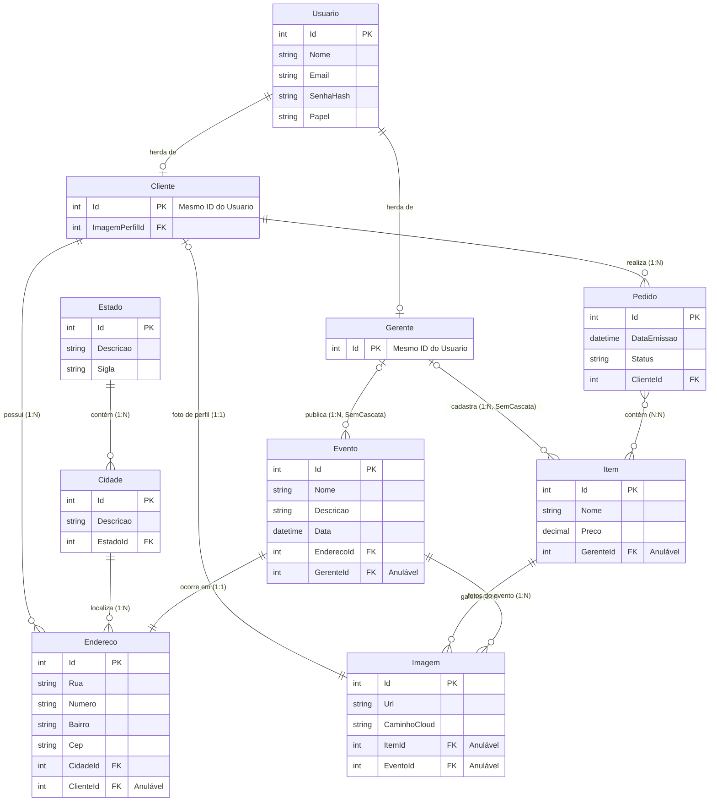

```mermaid
erDiagram
    %% Herança
    Usuario ||--o| Cliente : "herda de"
    Usuario ||--o| Gerente : "herda de"
    
    %% Relacionamentos do Cliente
    Cliente ||--o{ Endereco : "possui (1:N)"
    Cliente ||--o{ Pedido : "realiza (1:N)"
    Cliente |o--|| Imagem : "foto de perfil (1:1)"
    
    %% Relacionamentos do Gerente
    Gerente |o--o{ Item : "cadastra (1:N, SemCascata)"
    Gerente |o--o{ Evento : "publica (1:N, SemCascata)"
    
    %% Relacionamentos de Localização
    Estado ||--o{ Cidade : "contém (1:N)"
    Cidade ||--o{ Endereco : "localiza (1:N)"
    
    %% Relacionamentos de Vendas e Eventos
    Pedido }o--o{ Item : "contém (N:N)"
    Item ||--o{ Imagem : "galeria (1:N)"
    
    Evento ||--|| Endereco : "ocorre em (1:1)"
    Evento ||--o{ Imagem : "fotos do evento (1:N)"

    Usuario {
        int Id PK
        string Nome
        string Email
        string SenhaHash
        string Papel
    }

    Cliente {
        int Id PK "Mesmo ID do Usuario"
        int ImagemPerfilId FK
    }

    Gerente {
        int Id PK "Mesmo ID do Usuario"
    }

    Evento {
        int Id PK
        string Nome
        string Descricao
        datetime Data
        int EnderecoId FK
        int GerenteId FK "Anulável"
    }

    Pedido {
        int Id PK
        datetime DataEmissao
        string Status
        int ClienteId FK
    }

    Item {
        int Id PK
        string Nome
        decimal Preco
        int GerenteId FK "Anulável"
    }

    Endereco {
        int Id PK
        string Rua
        string Numero
        string Bairro
        string Cep
        int CidadeId FK
        int ClienteId FK "Anulável"
    }

    Cidade {
        int Id PK
        string Descricao
        int EstadoId FK
    }

    Estado {
        int Id PK
        string Descricao
        string Sigla
    }

    Imagem {
        int Id PK
        string Url
        string CaminhoCloud
        int ItemId FK "Anulável"
        int EventoId FK "Anulável"
    }
```
